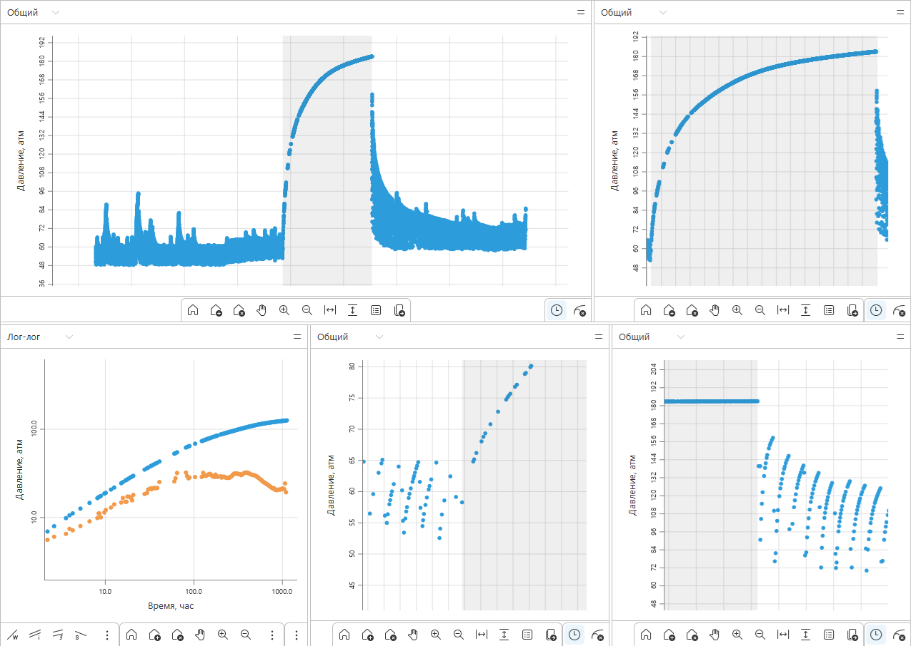
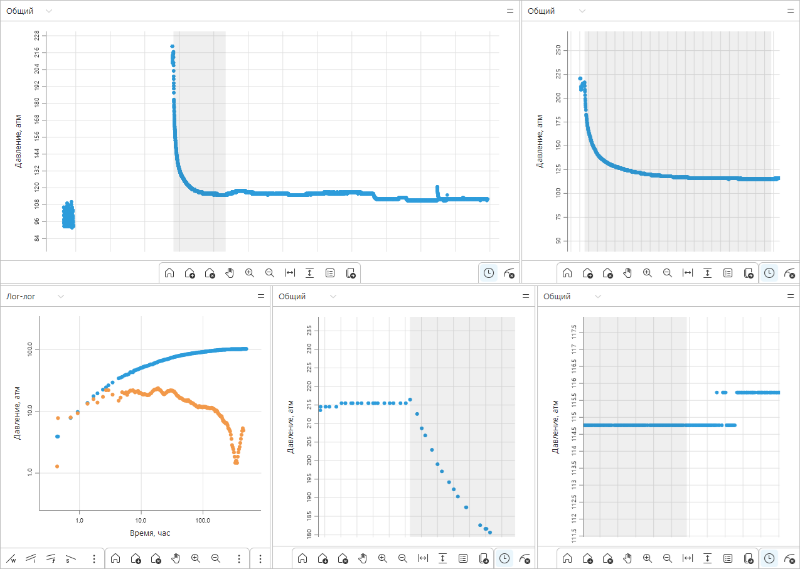
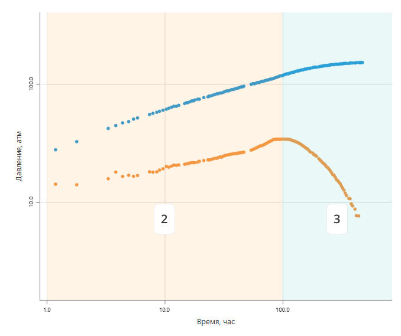

# Обнаружение паттернов изменения давления в нефтяных скважинах

## 1. Обзор

### Описание задачи
В нефтегазовой отрасли стационарные датчики непрерывно собирают данные о давлении в добывающих скважинах. Из-за большого количества скважин и огромных объемов данных ручной анализ становится неэффективным.

В этом соревновании вам нужно разработать алгоритм, который автоматически выделяет два ключевых паттерна во временных рядах давления:
- **КВД (Кривая Восстановления Давления, рекавери)** – характеризует процесс остановки работы скважины.
- **КПД (Кривая Падения Давления, дроп)** – характеризует процесс запуска работы скважины.

Примеры выделения таких паттернов приведены в **Приложении 1**.

### Ценность для производства:
- Снижает затраты на ручную разметку и анализ больших объемов данных.
- Позволяет в режиме реального времени обнаруживать информативные данные.
- Может использоваться для построения сложных алгоритмов автоматической интерпретации данных.

### Применение решения
1. Автоматизированная интерпретация данных давления в скважинах.
2. Анализ исторических данных для выявления пропущенных полезных участков данных.
3. Интеграция в системы мониторинга для автоматической интерпретации данных.

---

## 2. Оценка качества решений

### Метрика
Решения оцениваются по **F1-мере**, которая учитывает **точность (Precision)** и **полноту (Recall)** детекции событий:

$$
F1 = 2 \times \frac{Precision \times Recall}{Precision + Recall}
$$

Где:
- **Precision** — доля правильно найденных паттернов среди всех предсказанных.
- **Recall** — доля найденных паттернов среди всех истинных.

### Методика сопоставления интервалов
Сравнение предсказанных интервалов с эталонной разметкой проводится с учётом допустимых отклонений:
- **Начало интервала**: допустимое отклонение **±5 минут** (или **0.08333 часа**).
- **Конец интервала**: допустимое отклонение **10% от длительности истинного интервала**.
- Интервал засчитывается как **TP (True Positive)**, если оба условия соблюдены.
- Интервалы, не найденные алгоритмом, считаются **FN (False Negative)**.
- Интервалы, предсказанные ошибочно, считаются **FP (False Positive)**.

Дополнительно для более качественной оценки участков данных рекомендуется строить **диагностические графики**. Более подробно про них можно узнать в **Приложении 4** и **Приложении 5**.

---

## 3. Данные

### Описание датасета
Участникам предоставляются временные ряды давления из нефтяных скважин. Каждый файл представляет собой один скважинный замер и содержит столбцы:

| Время (часы) | Давление (атм) |
|--------------|---------------|
| 0.000000     | 155.3361      |
| 0.008889     | 149.8388      |
| 0.386667     | 144.9028      |
| 0.398056     | 140.4991      |
| 0.648611     | 131.4633      |

Дополнительно в обучающем наборе предоставлены файлы разметки, содержащие следующие колонки:

| file                                      | mark                                | recovery                                      | drop                         |
|-------------------------------------------|-------------------------------------|-----------------------------------------------|------------------------------|
| 00e03657-8e1e-139c-a734-1d3c77b48510      | [0.0, 235.92, 237.06, ...]         | [[1420.98, 2438.42], [2178.79, 3454.68]]     | [[4454.68, 4764.96]]        |
| 00e4d2a2-36d2-32b4-be81-c55aed75f306      | [0.0, 7979.23, 13285.46]           | []                                            | [[13285.46, 16539.80]]      |

Где:
- **file** – имя файла с данными.
- **mark** – временные точки, в которых наблюдаются изменения тренда.
- **recovery** – интервалы восстановления давления (**КВД**).
- **drop** – интервалы падения давления (**КПД**).

---

## 4. Формат представления решений

### Как должен выглядеть ваш ответ
Вы должны отправить **CSV-файл** с предсказанными интервалами:

| file                                     | recovery                                     | drop                         |
|------------------------------------------|---------------------------------------------|------------------------------|
| 00e03657-8e1e-139c-a734-1d3c77b48510     | [[1420.98, 2438.42], [2178.79, 3454.68]]   | [[4454.68, 4764.96]]        |
| 00e4d2a2-36d2-32b4-be81-c55aed75f306     | []                                          | [[13285.46, 16539.80]]      |

Файл загружается в систему **Codenrock** и сравнивается с эталонными разметками по метрике **F1-score**.

---

## 5. Дополнительные материалы

Для удобства участников предоставляются следующие приложения:
- **Приложение 1** – поиск паттернов на временных рядах давления.
- **Приложение 2** – аномалии и артефакты в данных.
- **Приложение 3** – формирование синтетических данных для моделирования работы скважины.
- **Приложение 4** – построение диагностического графика для верификации участка данных.
- **Приложение 5** – примеры диагностических графиков.

Эти материалы помогут лучше понять данные, возможные ошибки алгоритма и способы их исправления.

# Приложение 1. Поиск паттернов на временных рядах давления

В данной работе мы анализируем временные ряды давления, выделяя в них характерные паттерны, связанные с работой добывающих скважин. Основная цель — обнаружить паттерны типа «кривая восстановления давления» (КВД, recovery) и «кривая падения давления» (КПД, drop).

---

## 1. Основные паттерны

### 1.1. КВД (recovery)

**КВД (кривая восстановления давления)** — это процесс при котором давление с какого-то «рабочего» уровня восстанавливается до пластового давления (или близкого к нему).

**Основные признаки КВД:**
1. Функциональный резкий рост давления после смены режима.
2. Обычно после стабильного периода работы скважины на стабильном дебите, но не всегда.
3. Достаточная продолжительность по времени, не менее 4 часов (может длиться сутки, неделю или даже месяц и более, но это реже).
4. Желательно должна иметь достаточное количество точек, нижняя граница — 20 штук. Этим критерием можно пренебречь при обучении модели.


### 1.2. КПД (drop)

**КПД (кривая падения давления)** — это процесс при котором давление падает с пластового давления (или близкого к максимальному) до рабочего.

**Основные признаки КПД:**
1. Функциональное резкое падение давления после смены режима.
2. Обычно после длительной остановки (скважина стояла, давление было максимальным, потом начинается откачка).
3. Отличается от КСД тем, что идёт с **абсолютного максимума** по давлению (или около него), а КСД может начинаться с произвольнных значений.
4. Достаточная продолжительность по времени — обычно КПД длиннее, чем КВД (если не прерывается шумами или сменами режимов).
5. КПД, как правило, всегда более шумные, чем КВД.


### 1.3. КСД (стабилизация давления)

**КСД** — это «кривая стабилизации давления», когда давление с одного «рабочего» уровня восстанавливается/падает до другого «рабочего» уровня. В рамках данной работы **такие паттерны не рассматриваем**, так как они обладают меньшей степенью информативности.

---

## 2. Общие требования к выделению паттернов

Для **обоих паттернов (КВД и КПД)** справедливы следующие утверждения:

1. **Высокая детализация исследования** — количество точек на интервале выделенного паттерна должно быть достаточно плотным, не менее 20 штук, однако в рамках данной работы рекомендуется не устанавливать такое правило при обучении модели, будет лучше фильтровать выход из модели при помощи алгоритмов.
2. **Отсутствие шумов и функциональных изменений кривой** во время периода. Наличие сильных шумов или скачков будет говорить о некачественном выделении данных или о низком качестве данных в целом.

**Важное примечание**: в данной работе мы рассматриваем только добывающие скважины. Однако бывают также нагнетательные, где при запуске скважины давление растёт, а при остановке — падает (всё «зеркально»). Но все прочие признаки и особенности там будут такими же.

---

## 3. Примеры выделения паттернов (КВД и КПД)

Ниже приведены примеры выделения паттернов из массива данных с разными кейсами и пояснениями к ним.

---

### Пример 1

1. **Обзорный график**: на нём можно увидеть достаточно большой участок рекавери (КВД). Он идёт после продолжительной относительно стабильной работы скважины и заканчивается очень явно — наблюдается явное падение давления.
2. По данному рекавери строится качественный диагностический график. Интересный момент здесь — скважина работает в периодическом режиме: раз в какой-то небольшой период останавливается и запускается. При приближении можно увидеть «пилы» давления. 
3. Из-за этого эффекта мы не можем получить дроп (КПД) после окончания рекавери, так как запуск скважины идёт неравномерно, периодами. 
4. Также на графике обзора всех данных можно увидеть ещё пару остановок, но они слишком короткие, и оттуда ничего нельзя извлечь.


*Слева-направо, сверху-вниз: график обзора, выделенный участок, диагностический график, зум а точку начала участка, зум на точку окончания участка*

---

### Пример 2

1. На данном **графике** можно увидеть достаточно короткую остановку. Если посмотреть её в масштабе, то окажется, что она вполне подходит для анализа — кривая имеет равномерный тренд, но содержит произвольные шумы, скорее всего связанные с работой датчика.
2. Если почистить данные от шумов, получится вполне читаемый диагностический график, из которого можно извлечь полезную информацию. Рекавери начинается весьма явно и также явно заканчивается отсутствием данных. Далее наблюдается запуск скважины.


*Слева-направо, сверху-вниз: график обзора, выделенный участок, диагностический график, зум а точку начала участка, зум на точку окончания участка*

В этом кейсе интересный момент: на общем графике может показаться, что тут можно выделить и дроп, но если приблизить, то увидим «микроостановку» почти сразу после запуска скважины. Эта микроостановка ломает всю кривую, и такой дроп неинформативен.


---

### Пример 3

1. Здесь на **общем графике** мы видим множество участков рекавери и последующих за ними дропов.
2. Рассмотрим один из них поближе. Можно увидеть явное рекавери, которое начинается и заканчивается весьма «чисто». Диагностический график получается качественным.
3. Из такого куска данных, если рассматривать каждый период детально, можно извлечь несколько рекавери и дропов.


*Слева-направо, сверху-вниз: график обзора, выделенный участок, диагностический график, зум а точку начала участка, зум на точку окончания участка*

Что касается дропа после конкретно этого рекавери — он некачественный: мы видим мало точек (не более 20), потом идёт резкий переход в условную «константу» по давлению, которая, скорее всего, обусловлена работой автомата насоса скважины.


---

### Пример 4

1. На **общем графике** обзора можно увидеть очень хороший дроп (КПД). 
2. Если приблизить, то можно вытащить ещё и рекавери, но в данном примере нас интересует именно дроп. Начинается он явно после остановки, а заканчивается не совсем явно: виден небольшой перебой в работе (небольшой скачок давления), который уже достаточно значим, чтобы прекратить выделение области дропа.
3. Диагностический график по дропу строится качественным и информативным.
4. На общем графике есть ещё несколько дропов, но все они идут от малого абсолютного давления и сами по себе довольно короткие — такие выделять не нужно.


*Слева-направо, сверху-вниз: график обзора, выделенный участок, диагностический график, зум а точку начала участка, зум на точку окончания участка*

Как уже говорилось, тут есть ещё рекавери до выделенного дропа (можно изучить). Но последующие рекавери и дроп являются неинформативными, поскольку рекавери слишком короткий, а дроп начинается с малого абсолютного давления.


---

### Пример 5

1. На **графике обзора** наблюдается один единственный дроп. Начинается он явно, а заканчивается спорно.
2. В данном случае метку окончания дропа поставили в месте, где сменяется тренд давления. Мы не видим явного паттерна изменения режима, однако функция изменения давления меняет своё направление — все последующие данные при анализе дропа не будут нести смысла.
3. Датчик, записывающий давление, имеет низкую разрешающую способность, из-за чего мы видим «полочки давления». В таких условиях сложно точно определить точку конца режима, поэтому её ставят «на глаз».


*Слева-направо, сверху-вниз: график обзора, выделенный участок, диагностический график, зум а точку начала участка, зум на точку окончания участка*

---

### Пример 6 (пример некорректного выделения паттерна)

1. На **графике обзора** мы видим хороший рекавери (КВД). Даже в приближении не наблюдаются проблемы в выделении.
2. Но если приблизить конкретные области начала и конца рекавери, то можно увидеть, что точки начала и окончания выставлены неправильно:
   - Точка начала смещена влево, из-за чего на диагностическом графике начало производной слишком «задирается».
   - Точка окончания смещена вправо, и поэтому в конце графика появляется нехарактерное падение функции давления.
3. Это приводит к некорректной форме диагностического графика. Производная «уходит» выше реальной функции давления, а в конце кривая падает там, где уже, по сути, должен был закончиться паттерн.


*Слева-направо, сверху-вниз: график обзора, выделенный участок, диагностический график, зум а точку начала участка, зум на точку окончания участка*

---

## 4. Заключительные замечания

1. **КВД (recovery)** и **КПД (drop)** — два ключевых паттерна, которые несут наибольшую пользу в анализе работы скважин.
2. **КСД (stabilization)** в рамках данной задачи **не рассматривается**.
3. При выделении паттернов важно:
   - Корректно и точно определить начало и конец интервала по времени.
   - Убедиться в отсутствии сильных шумов и иных артефактов.
   - Иметь достаточно плотную выборку на малых временах интервала.
4. Некорректные границы паттерна или шумы в данных могут сильно исказить результаты анализа и привести к ошибочным выводам.

Таким образом, следуя вышеописанным критериям и учитывая приведённые примеры, мы можем эффективно и осознанно выделять паттерны КВД и КПД из временных рядов давления.

# Приложение 2. Аномалии и артефакты в данных

При анализе временных рядов давления важно понимать, какие аномалии могут встречаться в данных. Это необходимо для корректной работы алгоритмов выделения паттернов и обучения моделей. В данном разделе рассмотрены основные типы технологических шумов, с которыми можно столкнуться.

---

## 1. Пропуски данных

Пропуски данных — довольно частое явление. Они могут возникать по разным причинам:
- **Остановка скважины** (например, на ремонт);
- **Перебои в питании оборудования**;
- **Ручное вмешательство** — геологи могли удалять артефакты или некорректные измерения.

Пропуски **не являются критичной проблемой**, если тренд давления остаётся читаемым. Однако, если пропуски настолько значительные, что тренд становится неочевидным, это уже может создать сложности при анализе.


---

## 2. Периодическая работа

Этот тип шума встречается редко. При отдалённом рассмотрении график может выглядеть как шум, но при приближении становится виден **пилообразный паттерн**. Периодическая работа **не является критической проблемой**, но она может испортить выделение **КПД (дропов)**, так как мешает корректному определению начала и конца паттерна.


---

## 3. Низкая разрешающая способность датчика

Некоторые старые датчики, до сих пор используемые в скважинном оборудовании, имеют **низкую разрешающую способность** — например, **0.1 атм или даже 1 атм**. Это приводит к специфическому поведению данных:
- Давление отображается **ступенчатыми "полочками"** вместо плавного изменения.
- При **малых перепадах** давления сложно определить **точку окончания** паттерна (а иногда и начала).
- Данные становятся **шумными**, что усложняет диагностику.

Тем не менее, **избавляться от таких данных не стоит** — они всё ещё могут содержать полезную информацию.


---

## 4. Низкая дискретность данных

Причины низкой дискретности:
- Устаревшее оборудование (аналогично предыдущему пункту);
- Особые настройки системы записи данных.

Последствия:
- **Трудности в диагностике изменений режимов** — малое количество точек может скрывать кратковременные переходные процессы;
- **Слабая информативность на малых временах** — сложно анализировать тренды сразу после смены режима;
- **Проблемы с выявлением шумов** — при малом количестве точек трудно отличить шум от реального изменения давления.

Тем не менее, такие данные всё же можно анализировать и находить в них полезные участки.


---

## 5. Неоднородная дискретность

На протяжении временного ряда **дискретность измерений может меняться**. Это связано с несколькими факторами:
- Пропуски данных;
- Ручное вмешательство (коррекция, фильтрация);
- Работа автоматики (неравномерная запись);
- Замена оборудования (изменение параметров регистрации данных).

Для человека такие изменения обычно **не критичны**, но для алгоритмов машинного обучения **неоднородная дискретность может стать проблемой**. Неравномерное распределение точек может повлиять на работу фильтров и методов анализа временных рядов.


---

## 6. Выбросы

Выбросы — это аномальные точки, которые сильно выбиваются из общего тренда, но на этот тренд по сути не влияют. Обычно выбросы связаны с:
- Сбоем в работе оборудования;
- Ошибками в записи данных.

Выбросы **нужно игнорировать**. Если их не удалять перед анализом, алгоритмы могут **неправильно определить окончание тренда** (оборвать его на выбросе);

Как правило, выбросы чистят вручную перед основным анализом.


---

## 7. Технологические шумы

Это наиболее объёмный и трудно формализуемый тип шумов. Они встречаются **очень часто** и могут сильно повлиять на анализ данных.

Что можно отнести к технологическим шумам:
- **Физические работы на скважине** (любые типы работы со скжиной во время ее работы);
- **Износ датчика** (неравномерность в данных из-за деградации оборудования);
- **Спуско-подъёмные операции** (если датчик фиксирует давление во время перемещения);
- **Любые внешние воздействия** на скважину, не связанные с естественным притоком жидкости.

Основное свойство технологических шумов — **они накладываются на тренд давления, но не связаны с геологическими процессами**. Иногда это просто небольшой шум, а иногда — сильные изменения, которые могут этот тренд искажать.

В отличие от выбросов, **такие шумы нельзя просто удалить**, так как они глубоко въедаются в полезные данные и их удаление может приводить к удалению полезной информации.


---

## Итоговые выводы

В данных, используемых для анализа, можно встретить разные виды шумов и аномалий. Основные из них:
1. **Пропуски данных** — не критичны, если тренд остаётся читаемым.
2. **Периодическая работа** — может искажать КПД (дропы).
3. **Низкая разрешающая способность датчика** — приводит к ступенчатым "полочкам" давления.
4. **Низкая дискретность данных** — усложняет анализ переходных процессов.
5. **Неоднородная дискретность** — может сломать алгоритмы обработки данных.
6. **Выбросы** — единичные точки, выбивающиеся из тренда, которые надо игнорировать.
7. **Технологические шумы** — разнообразные иные аномалии в данных, не связанные с геологией.

Понимание этих особенностей поможет **разработать алгоритмы, устойчивые к шумам**, и **корректно обучить модели**, которые смогут анализировать временные ряды давления даже в условиях сложных искажений.

# Приложение 3. Формирование синтетических данных для моделирования работы скважины

---

## 1. Контекст и идея

При решении задач, связанных с прогнозом работы нефтяных (или газовых) скважин, часто возникает необходимость иметь репрезентативные датасеты. Однако реальные данные сложно достать в нужном объёме, либо они могут быть засекречены. Поэтому возникает необходимость генерировать синтетические данные, которые, с одной стороны, достаточно просты в вычислении, а с другой – «правдоподобны», чтобы обучать на них модели машинного обучения.

В данной задаче мы рассматриваем упрощённую физическую модель изменения забойного (или устьевого) давления $p$ во времени $t$ в результате работы скважины с заданным дебитом $q$ В основе лежит функция:

$$
p = q \ln(t),
$$

которая в базовом виде отражает некоторую зависимость давления от времени для постоянного дебита.

Однако реальные скважины эксплуатируются в разных режимах. В каждый момент перехода на новый режим мы можем рассматривать это так, будто первая «виртуальная» скважина останавливается (её дебит становится отрицательным) и запускается вторая – уже с новыми параметрами. Формально, когда режим меняется, мы можем «добавлять» или «убирать» разные потоки как суперпозицию нескольких виртуальных источников.

### Суперпозиция

Идея суперпозиции заключается в том, что если у нас есть несколько режимов работы скважины с разными дебитами и моментами времени переключения, то результирующее давление в момент времени $t$ получается как сумма (с учётом знаков дебита) вкладов каждого режима:

$$
P_{\text{total}}(t) = \sum_{k=1}^{K} q_k \ln\bigl(t - t_{k,\text{start}}\bigr),
$$

где $q_k$ – дебит $k$-го режима, а $t_{k,\text{start}}$ – момент времени, когда этот $k$-й режим «стартует». Если режим прекращается, это эквивалентно добавлению скважины с отрицательным дебитом.

Таким образом, при наличии нескольких смен режимов получается «лесенка» из источников. Для каждого режима в моменты перехода мы можем записать:
- «Включение» нового режима $q_{\text{new}}$.
- «Отключение» старого режима (формально – добавляем поток $-q_{\text{old}}$).

В итоге расчет можно свести к последовательному складыванию вкладов от всех «запущенных» (или «остановленных») виртуальных скважин.

### Генерация данных

1. **Начальный дебит**: включаем первую скважину с дебитом $q_1$.  
2. **Смена режима**: в момент $t_1$ останавливаем первую скважину (это добавляет источник с дебитом $-q_1$) и запускаем вторую с дебитом $q_2$.  
3. **Следующая смена**: в момент $t_2$ «останавливаем» вторую ($-q_2$) и «запускаем» третью $q_3$.  
4. И так далее для $n$-го количества смен.  

Каждая смена режима (или «лестница» из нескольких режимов) генерирует свой набор значений давления во времени, который может служить обучающим примером для моделей.

---

## 2. Математическое описание

Пусть у нас есть последовательность шагов (режимов) работы скважины:  

$$
(\Delta t_1, q_1), \quad (\Delta t_2, q_2), \quad \dots, \quad (\Delta t_n, q_n),
$$

где $\Delta t_i$ — длительность $i$-го режима, а $q_i$ — дебит в этом режиме. Для простоты будем вести отсчёт времени последовательно и введём суммарное время:  

$$
T = \sum_{i=1}^{n} \Delta t_i.
$$

Обозначим моменты смены режимов (накопленное время) как  

$$
t_i = \sum_{k=1}^{i} \Delta t_k, 
$$  

при этом по определению $t_0 = 0$. То есть:  
- при $t = 0$ включается первый режим ($q_1$);
- при $t = t_1$ выключается первый режим и включается второй ($-q_1$ и $+q_2$);
- при $t = t_2$ выключается второй и включается третий ($-q_2$ и $+q_3$);
- и так далее, вплоть до $t_{n-1}$, где выключается $(n-1)$-й режим и включается $n$-й.

С точки зрения принципа суперпозиции такое поведение можно рассматривать как внесение «источников» (положительный дебит) и «стоков» (отрицательный дебит) в моменты времени $t_i$. При включении $i$-го режима в момент $t_{i-1}$ добавляется «источник» $+q_i$, а при отключении этого же режима (в момент $t_i$) — «источник» $-q_i$.

Таким образом, результирующее давление $P(t)$ в произвольный момент $0 \le t \le T$ можно представить в виде суммы трёх частей:

1. **Начальное давление** $P_0$.
2. **Сумма вкладов от «включений»** всех $n$ режимов:

$$
\sum_{i=1}^{n}
\Bigl[q_i \ln\bigl(t - t_{i-1}\bigr)\Bigr],
$$

   где каждое слагаемое $q_i \ln(t - t_{i-1})$ учитывается только при $t > t_{i-1}$.
3. **Сумма вкладов от «выключений»** (реверсов) предыдущих режимов:

$$
\sum_{i=1}^{n-1}
\Bigl[-q_i \ln\bigl(t - t_i\bigr)\Bigr],
$$

   где каждое слагаемое $-q_i \ln(t - t_i)$ учитывается только при $t > t_i$.

Итоговая формула принимает вид:

$$ 
P(t) = P_0 + \sum_{i=1}^{n} q_i \ln\bigl(t - t_{i-1}\bigr) + \sum_{i=1}^{n-1} (-q_i) \ln\bigl(t - t_i\bigr)
$$

Итак, мы имеем:
1. Начальное давление $P_0$.
2. Логарифмические вклады от всех включений режимов.
3. Логарифмические «минус-вклады» от выключений (предыдущих) режимов.

Такая формула описывает упрощенную модель работы скважиы при последовательной смене режимов ее работы.

---

## 3. Пример кода

Ниже приведён пример на языке Python, в котором пошагово:

1. Определяется набор «шагов» (режимов) в виде пар $(\Delta t, q)$.  
2. Переводится список шагов в «кумулятивные» моменты времени (функция `convert_steps`).  
3. Готовится контейнер для давлений (функция `prepare_pressure_container`).  
4. Для каждого момента времени вычисляется давление с учётом суперпозиции режимов (функция `calc_data`).  
5. Полученный результат визуализируется (функция `plot_pressures`).  

Обратите внимание, что это лишь иллюстративная реализация, упрощающая реальную задачу. Однако она хорошо демонстрирует идею: суммирование вкладов от разных «виртуальных» скважин и моделирование давления во времени.

```python
import numpy as np
import matplotlib.pyplot as plt

def convert_steps(steps):
    """
    Преобразует шаги (длительность, дебит) в кумулятивную форму.
    Например:
    steps = [[100, 100], [100, 50], [1000, 0], [100, 100]]
    -> Новый формат с учетом суммарного времени:
    """
    ans = np.zeros((len(steps) + 1, 2))
    for i in range(len(steps)):
        ans[i + 1, 0] = ans[i, 0] + steps[i][0]  # Копим время
        ans[i + 1, 1] = steps[i][1]             # Сохраняем дебит
    return ans

def prepare_pressure_container(rates, pi, count):
    """
    Генерирует контейнер (список) точек времени и давления.
    'rates' - массив, где rates[i, 0] - это кумулятивное время,
              rates[i, 1] - дебит.
    'pi' - начальное давление.
    'count' - сколько точек брать на каждый временной интервал.
    """
    pressures = []
    t = 0
    for i in range(1, len(rates)):
        dt = (rates[i][0] - rates[i - 1][0]) / count
        for j in range(count):
            pressures.append((t + dt * (j + 1), pi))
        t = rates[i][0]
    return pressures

def cal_pressure(q, t):
    """
    Простейшая модель: p = q * ln(t), если t > 0, иначе 0.
    """
    return q * np.log(t) if t > 0 else 0

def calc_data(pressures, rates):
    """
    На основе принципа суперпозиции вычитаем/добавляем вклад от каждой "виртуальной" скважины.
    pressures - список (t, p)
    rates     - массив (t, q), где t - моменты смены и q - дебиты
    """
    for i in range(len(pressures)):
        t, p = pressures[i]
        # Пройдем по всем режимам, начиная со второго
        # (т.к. первый режим - это начальное давление p, которое уже учтено в pi)
        for k in range(1, len(rates)):
            t_shifted = t - rates[k - 1, 0]
            # Вычитаем вклад дебита, который закончился
            p -= cal_pressure(rates[k, 1], t_shifted)
            # Добавляем вклад дебита, который действовал ранее
            p += cal_pressure(rates[k - 1, 1], t_shifted)
        pressures[i] = (t, p)

def plot_pressures(pressures):
    """
    Отображаем давление во времени с помощью matplotlib.
    """
    times, values = zip(*pressures)
    plt.figure(figsize=(10, 5))
    plt.plot(times, values, marker='o', linestyle='-')
    plt.xlabel('Time')
    plt.ylabel('Pressure')
    plt.title('Pressure Change Over Time')
    plt.grid()
    plt.show()

if __name__ == "__main__":
    # Начальное давление
    pi = 300
    # Сколько точек на один режим
    count_per_step = 100
    
    # Описание шагов: (длительность режима, дебит)
    rates = np.array([
        [100, 100],   # Режим 1: 100 единиц времени, дебит 100
        [100, 50],    # Режим 2: 100 единиц времени, дебит 50
        [1000, 0],    # Режим 3: 1000 единиц времени, дебит 0 (остановка)
        [100, 100]    # Режим 4: 100 единиц времени, дебит 100
    ])
    
    # Конвертируем шаги в кумулятивный формат
    rates = convert_steps(rates)
    
    # Подготавливаем контейнер для давлений
    pressures = prepare_pressure_container(rates, pi, count_per_step)
    
    # Считаем итоговое давление с учетом суперпозиции
    calc_data(pressures, rates)
    
    # Визуализируем полученные данные
    plot_pressures(pressures)
```

### Ключевые моменты кода
1. **`convert_steps`**: превращает список шагов вида $[(\Delta t_1, q_1), (\Delta t_2, q_2), ...]$ в кумулятивную форму $[(t_0, q_0), (t_1, q_1), ...]$, где $t_i$ – накопленное время, а $q_i$ – дебит на этом интервале.
2. **`prepare_pressure_container`**: создаёт равномерные точки по оси времени для каждого режима, чтобы в дальнейшем в них вычислить давление.
3. **`cal_pressure`**: базовая модель $p = q \ln(t)$ (при $t > 0$).
4. **`calc_data`**: здесь учитывается принцип суперпозиции – суммирование вкладов от разных «виртуальных скважин» (режимов).
5. **`plot_pressures`**: выводит результат на график.

Таким образом, мы можем достаточно просто генерировать синтетические сценарии изменения давления при последовательном включении и выключении «виртуальных» источников (режимов). Эти данные могут затем использоваться для обучения, тестирования и валидации алгоритмов машинного обучения, связанных с прогнозированием давления или дебита в разных условиях эксплуатации.

# Приложение 4. Построение диагностического графика для верификации участка данных

---

## 1. Контекст и идея

Одним из способов проверить валидность выбранного интервала данных является построение **диагностического графика** (diagnostic plot). Визуальное распознавание закономерностей в таких графиках достаточно надёжно, поэтому «глаз эксперта» легко понимает, адекватно ли выглядит исследуемый временной отрезок. На базе подобного подхода можно даже обучить простую нейронную сеть, которая станет автоматически определять валидность интервала.

Однако у этого метода есть ограничения:

- Если интервал заведомо полностью невалиден или содержит «лишнюю информацию», график это хорошо покажет.
- Если же взять небольшой внутренний подынтервал из большого валидного интервала, то диагностический график также может показать, что он «валиден», хотя фактически это только часть полного процесса, и рассматривать его как отдельный корректный интервал — ошибка.

При **построении диагностического графика** требуется:
1. Выделить данные из общего массива по времени начала и конца интервала.
2. Посчитать функции  $\Delta P$ и  $\Delta t$ (по модулю), где из всех точек вычитаются давление и время для **первой** точки заданного интервала:

$$ 
\Delta P_i = |P_i - P_0|, \quad 
\Delta t_i = |t_i - t_0|.
$$

3. Вычислить производную  $\Delta P$ по логарифму времени (обычно это называют  $\frac{d(\Delta P)}{d(\ln t)}$) по центральной разности:

$$
P'\_i \approx \frac{\Delta P_{i+1} - \Delta P_{i-1}}{\ln(\Delta t_{i+1}) - \ln(\Delta t_{i-1})}.
$$

4. Построить **двойной логарифмический** график, на котором отображаются:
   -  $\Delta P$ в логарифмических осях,
   - производная  $P'$ (или  $\frac{d(\Delta P)}{d(\ln t)}$) также в логарифмических осях.
   
   При этом важно:
   - Сохранять **единую цену деления** по осям, чтобы не потерять визуальные диагностические признаки.
   - Для реальных (шумных) данных часто используют **окнонное сглаживание**. В задаче построения такого графика хорошо подходит сглаживание с окном в пределах 0.5 лог-цикла (коэффициент сглаживания до 0.5). Значения свыше 0.5 могут вносить большие искажения.
   
В **реальных кейсах** дополнительно может использоваться функция **суперпозиции времени** (Superposition Time), чтобы исключить искажения, связанные с работой скважины на предыдущих режимах. Ниже приведено уравнение такой функции (из фрагмента Java-кода), но в контексте данной задачи его рассчитать **не представляется возможным**, так как нам неизвестно распределение работы скважины во времени. Для самой **верификации** высокая точность суперпозиции обычно и не нужна.

---

## 2. Математическая формулировка функции времени суперпозиции 

Пусть есть список дебитов $q_i$ (Rate) и момент времени, в котором мы рассчитываем функцию, — $t$. Тогда величина $S_n(t)$ (суперпозиционное время) вычисляется по формуле:

$$
S_n (t) = \ln (t) + \sum_{i=1}^{N-1} \frac{(q_i - q_{i-1}) \ln (t + t_N - t_i)}{q_N}.
$$

Здесь:
- $q_i$ — расход (дебит) в момент времени $t_i$ (из списка Rate),
- $t_i$ — время изменения дебита,
- $t_N$ — время последнего изменения дебита (момент начала текущего режима),
- $N$ — общее количество изменений дебита,
- $t$ — текущее время, для которого рассчитывается суперпозиционное время.

Важно отметить, что в рамках данной задачи **будет проблематично вычислить** суперпозиционное время, так как отсутствуют полные данные о временных режимах работы скважины.


---

## 3. Пример кода

Ниже приведён пример на **Python**, демонстрирующий основные шаги построения диагностического графика **без** суперпозиции и **без** сглаживания. В примере использованы **синтетические** данные, сгенерированные скриптом из «Приложения 3».

```python
import numpy as np
import matplotlib.pyplot as plt

def process_pressure_data(data, t_min, t_max):
    # 1. Фильтрация данных по заданному интервалу времени
    data_filtered = [point for point in data if t_min <= point[0] <= t_max]
    times = np.array([point[0] for point in data_filtered])
    pressures = np.array([point[1] for point in data_filtered])

    # 2. Вычисление модуля ΔP и Δt
    p0 = pressures[0]
    t0 = times[0]
    delta_p = np.abs(pressures - p0)
    delta_t = np.abs(times - t0)

    # 3. Вычисление производной ΔP по логарифму времени (центральная разность)
    p_derivative = np.zeros_like(delta_p, dtype=float)
    for i in range(1, len(delta_t) - 1):
        t_prev, t_next = delta_t[i - 1], delta_t[i + 1]
        dp_prev, dp_next = delta_p[i - 1], delta_p[i + 1]
        p_derivative[i] = (dp_next - dp_prev) / np.log(t_next / t_prev)

    # Удаление «краевых» точек производной (там не определяется центральная разность)
    times_derivative = delta_t[1:-1]
    p_derivative = p_derivative[1:-1]

    # 4. Построение графика в двойных логарифмических координатах
    fig, ax = plt.subplots()
    ax.set_xscale("log")
    ax.set_yscale("log")
    ax.set_xlabel("Время (часы)")
    ax.set_ylabel("ΔP и P'")

    # Отображение точек без соединяющей линии
    ax.scatter(delta_t, delta_p, marker='o', label="$ΔP$")
    ax.scatter(times_derivative, p_derivative, marker='s', label="$P'$")

    ax.legend()
    ax.grid(True, which="both", linestyle="--", linewidth=0.5)

    # Установка одинаковой цены деления
    ax.set_aspect('equal', adjustable='datalim')

    plt.show()

# Синтетические «сырые» данные (пример)
raw_data = [
    (0, 300),
    (5, 235.622483502636),
    (10, 207.896596280238),
    # ... (данные сокращены для примера, см. файл synthetic-data.txt)
    (1300, 110.851256713742)
]

# Вызов функции с заданным интервалом
process_pressure_data(raw_data, t_min=50, t_max=150)
```

Обратите внимание, что для реальной практики **окнонное сглаживание** в логарифмических координатах существенно повышает устойчивость расчёта производной к шумам. Коэффициент сглаживания в пределах $0.5$ (в терминах логарифмических циклов) обычно хорошо компенсирует мелкие выбросы, не внося при этом сильных искажений в форму кривой.

---

**Таким образом**, предложенный диагностический график даёт возможность быстро «на глаз» оценить, выглядит ли интересующий нас временной интервал правдоподобно (валидно) или содержит аномалии и «лишние» переходные режимы. При необходимости такой подход можно автоматизировать с помощью алгоритмов машинного обучения или более сложных методов аппроксимации и суперпозиции времени. Примеры валидных и невалидных диагностических графиков с описанием можно посмотреть в «Приложении 5».

# Приложение 5. Примеры диагностических графиков

## 1. Общие свойства качественного диагностического графика

- **Рост функции ΔP**. Типичный «правильный» график демонстрирует функциональный рост значения  $\Delta P$.
- **Отсутствие резких изменений**. График $\Delta P$ не содержит резких скачков или провалов.
- **Завершение**. При нормальном построении график либо выходит в константу, либо продолжает плавно расти.
- **Три основные области** (могут присутствовать не все):
  1. **Область влияния ствола скважины** (1) - характеризуется ростом функции и производной с коэффициентом наклона равным 1, зачастую характеризуется горбом как на рисунке ниже, но его может и не быть, все зависит от того, какая далее будет работа пласта.
  2. **Область работы пласта** (2) - зачастую характеризуется стабильной производной, которая выходит на какой то конкретный угол наклона, обычно с коэффициентами 0.5, 0.25, 0, -0.5, на этом этапе такие стабильные режимы могут сменять друг друга; на примере ниже можно увидеть относительно стабильный режим с коэффициентом наклона 0.
  3. **Область влияния границ** (3) - характеризуется ростом или падением производной в конце графика, в случае с примером ниже мы наблюдаем именно рост производной


  Области всегда идут по порядку. Чаще всего встречается комбинация **1 → 2 → 3**, но бывают случаи пропуска отдельных фаз:

  - Может не быть **1**, сразу начинается **2**.
  

  - Может не быть **3**.
   
  


  - «Только 1» — крайне редкий и неинформативный случай.
  

  - «Только 2» — хороший, «чистый» кейс, часто встречающийся на практике.
  

---

## 2. Примеры артефактов при некорректном построении

Если диагностический график построен **неправильно**, могут проявляться следующие проблемы:

1. **Неверная точка старта**  
   График «начинается» в изломе или имеет странный скачок в начале.

   
   *Слева - график с некорретной точкой старта, справа - график с корректной точкой старта*

2. **Неверно обозначена точка старта** (захват нескольких режимов работы)  
   В среднем или позднем времени появляются разрывы или аномальные скачки $\Delta P$.

   
   *Слева - точка окончания режима установлена таким образом, что в область попадает сразу несколько режимов и технологические шумы, справа - корректно продобранная точка окончания области*

3. **Случайный набор данных**  
   При взятии интервала, не отражающего реальный переходный процесс, возникает шум без каких-либо характерных паттернов.

   

4. **Начало и конец графика «внутри» паттерна**  
   Диагностический график на вид может выглядеть корректно, но фактически это лишь часть полноценной кривой. Такой график становится «обманчиво нормальным». В такой ситуации данный график не приносит пользы и не дает полезной информации.

   
   *Слева - график со смещенной точкой старта вглубь области выделения, справа - корректно выбранная точка старта*

---

## 3. Примеры на синтетических данных (из Приложения 3)

Для наглядности возьмём те же синтетические данные, которые генерировались в Приложении 3. Ниже приведены несколько кейсов, показывающих, как выбор различных интервалов влияет на форму диагностического графика.

#### 3.1. Нормальное построение (интервал 200–1200 часов)

Если взять интервал $200 \le t \le 1200$, мы получим «качественный» график, в котором чётко наблюдается только вторая область (работа скважины):


### 3.2. Построение внутри интервала (300–1100 часов)

Если выбрать подынтервал внутри предыдущего (300–1100 часов), то мы получим несколько другой диагностический график, но он не будет противоречить стандартам качественного графика:


Это та самая проблема, когда внутри «корректного» большого интервала мы выделяем меньший промежуток, и график выглядит нормально, однако это может ввести в заблуждение, ведь мы анализируем не весь процесс, а только его часть.

### 3.3. Ошибка с точкой начала (взятие интервала левее 200 часов)

Если начать собирать данные **до** 200 часов, можно увидеть «кривое» начало графика:


### 3.4. Ошибка с точкой окончания (захват второго режима после остановки)

При значительном «промахе» по правой границе мы можем захватить второй режим работы (или какое то другое событие). На графике появляется «разорванность» $\Delta P$ в виде резкого падения, производная в этом случае уходит в отрицательную область и она становится невидимой для диагностического графика:


---

## 4. Поведение производной

В корректном диагностическом графике производная $\frac{d (\Delta P)}{d \ln t}$ может иногда **уходить в небольшие отрицательные значения** из-за физических особенностей процесса или шумов в данных. Однако:

- Функция $\Delta P$ в такие моменты может выглядеть волнообразно, но **без резких скачков**.


- **Любой резкий отрицательный или положительный скачок** функции $\Delta P$ — это почти всегда признак «плохого» интервала, неверно выбранных границ или ошибок в исходных данных.

---

## Заключение

Хороший диагностический график в логарифмических координатах даёт плавное поведение $\Delta P$ и характерные области переходных процессов. При этом важны:
- Корректная «начальная» точка,
- Правильное «окончание» интервала,
- Отсутствие лишних шумовых интервалов и смен режимов.

Любые резкие скачки или разрывы на графике $\Delta P$ и зачастую производной почти наверняка говорят о некорректности построения.